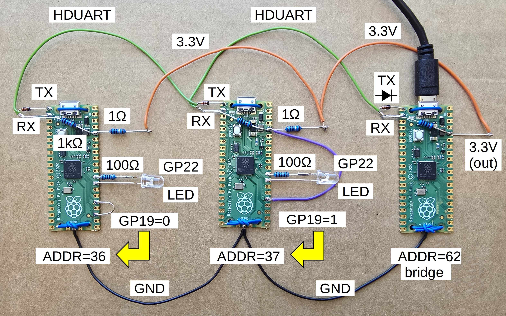

#Example project

The example project utilizes 3 Pi Pico boards:

 - one as the USB bridge device,
 
 - the other two as the redundant subsystem

Optionally 2 Pi Pico could be enough, in this case the subsystem is not redundant.

The minimal setup uses the HDUART interfaces (the CAN interfarce is optional, as requires external circuitry). The HDUART interface requires minimal hardware extension:

 - a small signal diode on the UART TX pin (this changes the behaviour to be open drain like)
 
 - a pull-up resitor on the common HDUART line

In the example the subsystem Pi Picos have an external LED attached (with a current limiting resistor). Optionally the onboard LED could be used.

## Prepare the git repository

A single run of the **initialize.sh** script is required. This will fetch the required external software components.

## Prepare the bridge

In the **pico_bridge** folder run the **build.sh** script. This will create the **build** folder. In this folder the **pico_bridge_bootloader.uf2** file has to be uploaded to the bridge Pi Pico.

When the target Pi Pico does not contain any previous code, connecting it to the computer via USB, will mount it as an external drive. The .uf2 file simply has to be copied (most simple is drag-and-drop) to that external drive.

In case the target Pi Pico already contains a previous code, the push button on the Pi Pico has to be pushed while connecting it to the computer. After connected the button can be released. Then the Pico will appear as an external drive.

In the example project only the bridge is connected and powered via the USB port. The other Pi Picos are powered from the 3V3 output of the bridge.

The diode and pull-up resistor required by HDUART have to be assembled to the board.

## Prepare the subsystems

When single Pi Pico used as the subsystem, the **ADDRESS_MODIFIER_ID_PIN** define in **pqp_defines.h** has to be commented / removed, before building the bootloader.

In the **pico_bootloader** run the **build.sh** script. This will create the **build** folder.In this folder the **pico_bootloader.uf2** file has to be uploaded to the subsystem Pi Pico, as described in the **Prepare the bridge** section.

The diode and pull-up resistor required by HDUART have to be assembled to the board.

Connect the HDUART interfaces of all Pi Pico boards together.

Connect ground and 3V3 pins of the subsystem board(s) to the brdige, to receive power supply. Optionally the 3V3 pins can be connected by inserting a 1 Ohm resistor, this provides an easy way to measure current consumption using a voltmeter.

In case redundant subsystem, the GPIO 19 pin of the boards have to be connected, on one of the board it has to be grounded, on the other it has to be connected to the 3V3 pin. This will set the LSb of the device's PQP address.

## Prepare the computer

Run both **build.sh** in the **pqp_gnd_hub** and the **gnd_apps** folders. 

The built **usb_hub** has to be run in the background. The serial device has to be provided as command parameter (typically */dev/ttyACM0*):

`./usb_hub /dev/ttyACM0`

The access to /dev/ttyACM0 is usually restricted. One solution is to run usb_hub as sudo. The recommended solution is to add your user to the dialout group:

`sudo usermod -a -G dialout $USER`

You may need to logout or reboot to take effect.

Set the routing table of the bridge using the built gnd app **set_routing_table** it's first command parameter is the address of the target device (in case of the bridge it is 62 but also the *bridge* as text could be used):

`./set_routing_table bridge`

In case the bridge the gnd app provides a text based menu. Here select the HDUART1 interface.

## Connectivity tests

After the above steps are performed, test that the subsystem boards are reachable, using the **ping** gnd app:

`./ping 36`

`./ping 37`

If you prefer text based addresses instead of numeric, add these to **gnd_app_base.c / convert_arg_to_addr** function, then rebuild the gnd apps.

If both subsystem Pico board is reachable, do transfer test with maximum payload (264 bytes):

`./transfer_test 36 264`

`./transfer_test 37 264`

## Create your own firmware

In the **pico_app** folder you can edit **main.c** and **main.h**, also new .c/.h files can be added, in this case **CMakeLists.txt** shall be edited.

Build the application using the **build.sh** script.

In the build folder the **pico_app.bin** has to be uploaded using the **upload_fw** gnd app. **IMPORTANT**: do not use the .uf2 file.

`./upload_fw 36 relative/or/absolute/path/to/pico_app.bin -a`

The `-a` switch is optional, but recommended, if the flash does not store anything else above the firmware.

If the upload process is finished, and the uploader indicates successful CRC check, the uploaded firmware can be started using the **run_fw** gnd app.

`./run_fw 36`

The successful firmware star can be tested using

`./ping 36`

## Remote control

The firmware of the example project can be controlled using either the **tty**  or the **led_control** gnd app.

Using **tty** the control is interactive. Enter *h* for the help menu.

The **led_control** is an example for custom gnd apps. The LED control parameter is passed as a command parameter:

`./led_control 36 0`

`./led_control 36 1`

